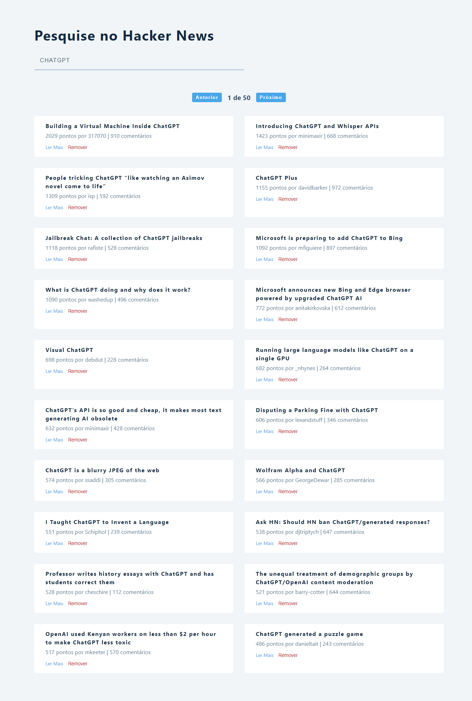

# Hacker News - News API Search

## Descrição

Uma página que exibe notícias retornadas de uma API externa.

## Detalhes

● Criei uma aplicação em React que consome uma API e lista as notícias com base no filtro da resposta dela.

● Implementei uma função de paginação de um grande número de dados (500 respostas) para a listagem de notícias da página.

## Link para acesso

https://hacker-news-search-blond.vercel.app/

# Prévia

